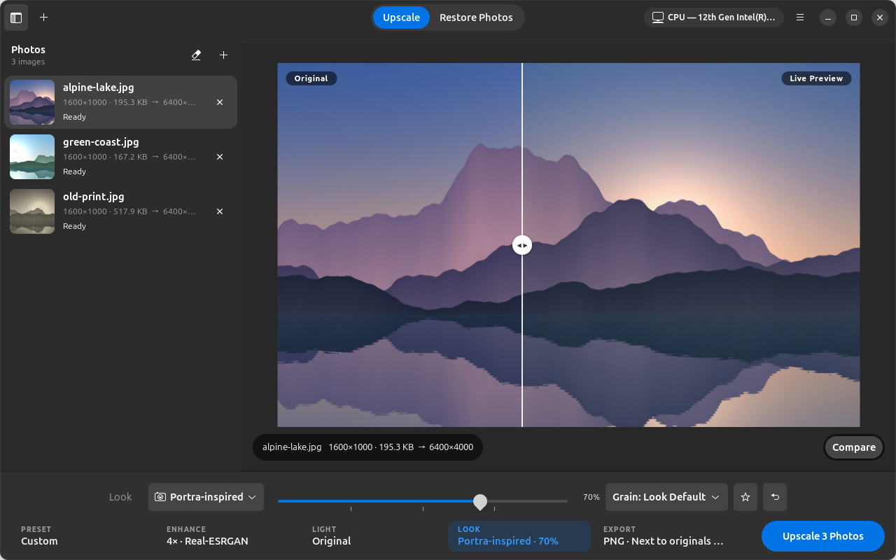
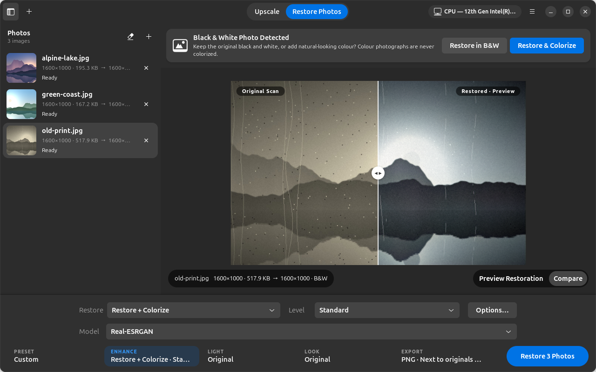
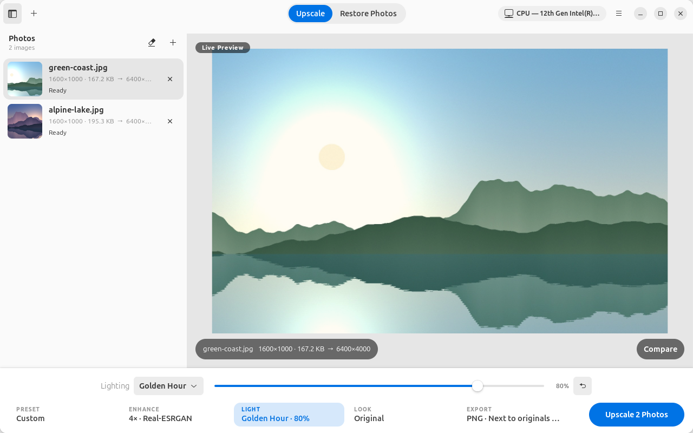

# Pixelift

**Make images larger and sharper with AI — entirely on your own computer.**

Pixelift is a native Ubuntu desktop app (GTK 4 + libadwaita) and command-line
tool that upscales images 2× or 4× with [Real-ESRGAN](https://github.com/xinntao/Real-ESRGAN)
super-resolution — and restores old photographs: dust, scratches, fading,
colour casts, faces, and optional colorization of black-and-white photos.

> 🔒 **Your images stay on your computer.** Processing is 100 % local. There
> is no account, no telemetry and no analytics. The internet is only used —
> when you ask — to download AI model files.



<table>
  <tr>
    <td></td>
    <td></td>
  </tr>
  <tr>
    <td align="center"><em>Restore Photos: preview the restoration and compare it on the photo — colorize only if you choose</em></td>
    <td align="center"><em>Lighting profiles previewed live (light theme)</em></td>
  </tr>
</table>

<sub>Sample images in the screenshots are generated by code; no real photographs are shown.</sub>

## Features

- Drag-and-drop or file picker; single files, multiple files or whole folders
- PNG, JPEG, WebP, TIFF and BMP input; PNG, JPEG or WebP output
- 2× and 4× upscaling, several Real-ESRGAN models (photo, fast, anime)
- NVIDIA (CUDA), AMD (ROCm) and Intel (XPU) GPU acceleration, with a reliable
  CPU fallback — GPUs are never required
- Tiled processing for very large images, automatic tile sizing and
  automatic recovery from out-of-memory errors
- Batch queue with progress, pause / resume / cancel, retry failed, skip completed
- Lighting profiles (Natural Daylight, Golden Hour, Cinematic, Low Light
  Recovery and more) or your own custom adjustments, applied before upscaling
  with a live preview
- **Camera Looks**: 30 camera- and film-inspired renderings (Sony-, Canon-,
  Nikon-, Fujifilm-, Leica- and Hasselblad-inspired, Kodak/Portra/Ektar-style
  film, cinematic and black-and-white) with intensity, film grain, skin-tone
  protection, favorites and your own saved looks — see [Camera Looks](#camera-looks)
- **AI Photo Restoration** for old scans: dust and scratch removal, noise
  reduction, faded-colour and yellowing correction, identity-preserving face
  restoration (GFPGAN), optional colorization of black-and-white photos
  (DeOldify), Modern Finish, and optional upscaling — see
  [Photo restoration](#photo-restoration)
- Before/after comparison: slider, toggle, zoom, pan, fit, 100 %
- Keeps EXIF orientation (no accidental rotation), EXIF metadata, ICC colour
  profiles, DPI, transparency and grayscale
- Model manager with SHA-256-verified downloads
- Light, dark and system theme; responsive layout
- A CLI that uses exactly the same engine as the app

## Requirements

| | |
|---|---|
| OS | Ubuntu 24.04 LTS or newer (or any distro with Python 3.12+, GTK ≥ 4.12, libadwaita ≥ 1.5) |
| RAM | 8 GB recommended; very large 4× results need more (Pixelift checks before starting) |
| Disk | ~1 GB for the app with PyTorch (CPU), plus 5–70 MB per model |
| GPU | Optional — see [GPU acceleration](#gpu-acceleration) |

## Installation

### Option A — `.deb` package (Ubuntu 24.04)

```bash
sudo apt install ./pixelift_1.1.0_amd64.deb
```

Pixelift then appears in the application launcher, and the `pixelift`
command is available in the terminal. The package bundles the CPU build of
PyTorch; GPU support is an optional extra step (below).

### Option B — AppImage

```bash
chmod +x Pixelift-1.1.0-x86_64.AppImage
./Pixelift-1.1.0-x86_64.AppImage            # desktop app
./Pixelift-1.1.0-x86_64.AppImage photo.jpg  # CLI
```

The AppImage bundles the app, PyTorch, numpy and Pillow, and uses the system's
Python 3.12 and GTK 4 / libadwaita (present on Ubuntu 24.04 desktops; otherwise
`sudo apt install python3-gi gir1.2-gtk-4.0 gir1.2-adw-1`). Running AppImages
needs FUSE 2 (`sudo apt install libfuse2t64`), or run it with
`--appimage-extract-and-run`.

### Option C — from source (development)

```bash
sudo apt install python3-gi gir1.2-gtk-4.0 gir1.2-adw-1 python3-venv
git clone https://github.com/eman003/pixelift.git
cd pixelift

# --system-site-packages makes the distro's PyGObject/GTK visible in the venv
python3 -m venv --system-site-packages .venv
source .venv/bin/activate

# CPU-only PyTorch (small). For NVIDIA use .../whl/cu126, AMD .../whl/rocm7.2,
# Intel .../whl/xpu — see https://pytorch.org/get-started/locally/
pip install torch --index-url https://download.pytorch.org/whl/cpu
pip install -e ".[dev]"

pixelift                               # start the desktop app
./scripts/install_desktop_entry.sh     # optional: add it to the app launcher
```

> If `python3 -m venv` says *ensurepip is not available*, install
> `python3-venv` (or `python3.12-venv`), or create the venv with
> `--without-pip` and bootstrap pip with `get-pip.py`.

## AI models

Models are **not** bundled. On first launch Pixelift detects your hardware,
explains that a model is needed, offers to download the recommended one
(nothing is downloaded without your consent), and runs a small test upscale.
You can manage models later in **Preferences → Models**.

| Model id | Name | Native scale | Size | Best for |
|---|---|---|---|---|
| `realesrgan-x4plus` | Real-ESRGAN x4 (recommended) | 4× | 67 MB | Photos, general images |
| `realesrgan-x2plus` | Real-ESRGAN x2 | 2× | 67 MB | Photos at 2× |
| `realesr-general-x4v3` | Real-ESRGAN General v3 (fast) | 4× | 4.9 MB | CPU-only computers |
| `realesrgan-x4plus-anime` | Real-ESRGAN Anime | 4× | 18 MB | Anime, illustrations |
| `realesr-animevideov3` | Real-ESRGAN Anime Video v3 (fast) | 4× | 2.5 MB | Anime, fast |

Photo restoration can use three more models. They are only needed for the
stages that use them, and Pixelift asks (showing size and license) before
downloading anything:

| Model id | Name | Version | Size | License | Used for |
|---|---|---|---|---|---|
| `gfpgan-v1.4` | GFPGAN | v1.4 | 349 MB | Apache-2.0 | Face restoration |
| `retinaface-resnet50` | RetinaFace face detector | facexlib v0.1.0 | 109 MB | MIT | Finding faces |
| `deoldify-artistic` | DeOldify | Artistic | 255 MB | MIT | Colorizing B&W photos |

In the app you pick a *model family* (e.g. "Real-ESRGAN") and a scale; Pixelift
uses the matching native-scale weights if installed, otherwise a larger-scale
model followed by high-quality downsampling.

**Licenses.** The upscaling weights are published by the Real-ESRGAN project under
the [BSD 3-Clause license](https://github.com/xinntao/Real-ESRGAN/blob/master/LICENSE)
and are downloaded from its official GitHub releases. The restoration models
come from their projects' official locations:
[GFPGAN](https://github.com/TencentARC/GFPGAN) (Apache-2.0),
[facexlib](https://github.com/xinntao/facexlib) (MIT) and
[DeOldify](https://github.com/jantic/DeOldify) (MIT). Every file is verified
against a SHA-256 checksum recorded in `pixelift/models/realesrgan.py` and
`pixelift/models/restoration.py`.

**Command line / offline installation:**

```bash
pixelift --list-models
pixelift --download-model recommended --download-model realesr-general-x4v3
python scripts/download_models.py --all

# Air-gapped machine: download the .pth file elsewhere, then
pixelift --install-model-file realesrgan-x4plus ~/Downloads/RealESRGAN_x4plus.pth
```

Models are stored in `~/.local/share/pixelift/models/` (override with
`PIXELIFT_MODELS_DIR`).

## Usage

### Desktop app

The window has three zones: the header (Upscale / Restore Photos), the
workspace — the selected photo on a neutral stage, with your photos in a
sidebar (**F9** shows or hides it) — and the dock at the bottom.

1. Drop images or folders onto the window (or click **Select Images**, Ctrl+O).
2. The dock has one tab per task, each showing its current setting:
   **Preset** (see [Presets](#presets)), **Enhance** (scale and AI model; restoration in Restore Photos mode),
   **Light** (see [Lighting](#lighting)), **Look** (see
   [Camera Looks](#camera-looks)) and **Export** (format and output folder).
   Click a tab to open its controls; click it again (or press **Esc**) to fold
   them away. The lighting and look are previewed live on the photo in the
   workspace — **Compare** splits it into before and after.
3. Click **Upscale** (it shows how many photos are waiting). Use **Pause**,
   **Resume**, **Cancel** and **Retry Failed** as needed. Images whose result
   already exists are skipped. A finished photo shows its result on the stage.
4. Compare and zoom right on the stage: **Compare** (or **C**, or
   double-clicking a photo in the sidebar) shows a before/after divider — drag
   it, or use **←/→**. Scroll or pinch to zoom, drag to pan, double-click for
   100 % and back; **1** = 100 %, **0** = fit, **+/−** zoom. Zoomed in, the
   visible part is shown at full resolution.

Results go to `<original folder>/upscaled/` by default, named with the template
`{name}_{scale}x` (e.g. `photo.jpg → photo_4x.png`). Template fields: `{name}`,
`{scale}`, `{model}`, `{width}`, `{height}`, `{ext}`, `{lighting}`, `{look}`.

When several images in one batch would get the same output name (e.g.
`photo.jpg` and `photo.png`), the one earlier in the queue gets `photo_4x.png`
and the next `photo_4x (2).png` — the same way on every run.

### Presets

The **Preset** tab offers a few one-click recipes, each previewed on your own
photo: **Natural** (balanced light and clean colour), **Portrait**,
**Landscape**, **Cinematic**, **Film**, **Vintage** and **Monochrome** — and in
Restore Photos mode **Old Photo** (standard repair of dust, scratches and
fading). **Original** clears everything.

A preset is a starting point made of Pixelift's own controls: it sets the
lighting profile, camera look, their intensities and the grain (Old Photo also
the restoration level). It never changes the scale, AI model, file format or
whether black-and-white photos are colorized. Change anything afterwards and
the tab shows *Natural · Modified*; **Reset to Natural** brings the preset back.

### Lighting

Lighting profiles adjust tone and colour **before** the AI model runs, so the
model reconstructs detail from the corrected image. Pick a profile in the
**Light** tab; the photo on the stage shows the result live (**Compare** puts
it side by side with the original).

| Profile | Effect |
|---|---|
| Original | No adjustment (default) |
| Natural Daylight | Balanced exposure and neutral colours |
| Bright & Clean | A brighter image with lifted shadows |
| Golden Hour | Warmer tones and softer highlights |
| Studio | Clean, bright lighting with controlled shadows |
| Cinematic | Deeper shadows, controlled highlights, stronger contrast |
| Low Light Recovery | Brighten dark areas while protecting highlights |
| Cool Daylight | Cooler temperature with crisp contrast |
| Vivid | Stronger colours and contrast |
| High Contrast | Dramatic highlights and shadows |
| Custom | Your own exposure, brightness, contrast, highlights, shadows, temperature, tint and saturation |

*Intensity* (0–100 %) scales a profile; 0 % is the original image.

The lighting is part of the output name — `photo_4x_golden-hour.png`,
`photo_4x_golden-hour-50.png` at 50 %, `photo_4x_custom-1a2b3c.png` for Custom
(Original adds nothing) — so results made with different lighting never
overwrite or get mistaken for each other. Put `{lighting}` in the filename
template to place it yourself. Changing the lighting puts finished images back
in the queue; their earlier results stay on disk. A grayscale image stays
grayscale unless the profile warms, cools or tints it.

### Camera Looks

A camera look gives a photo the colour rendering and character associated
with a camera maker's picture styles or a classic film stock: white balance,
tone curve, highlight roll-off, shadow tones, colour separation per hue,
micro-contrast, sharpening and (for film looks) grain — not a single colour
filter. In the **Look** tab click the look button to
open the gallery: every look is a card previewed on your own photo, filtered by
category (All, ★ Favorites, Sony, Canon, Nikon, Fujifilm, Leica, Hasselblad,
Film, Monochrome, My Looks). Star a card to make it a favorite.

> **Camera-inspired, not official.** The looks are Pixelift's own
> interpretations of popular styles. They are not manufacturer presets or
> colour science, and brand names are used only to describe the style, with
> no affiliation or endorsement.

| Group | Looks |
|---|---|
| Sony-inspired | Natural, Vivid, Portrait, Cinematic — clean, modern, crisp micro-contrast |
| Canon-inspired | Natural, Standard, Portrait, Landscape — warm reds, pleasant skin, smooth highlights |
| Nikon-inspired | Neutral, Standard, Portrait, Landscape — neutral, natural greens and blues |
| Fujifilm-inspired | Classic, Provia, Velvia, Astia, Classic Negative — rich but controlled colour, soft highlights |
| Leica-inspired | Natural, Monochrome, Filmic — tonal separation, clean highlights, documentary feel |
| Hasselblad-inspired | Natural, Filmic — smooth gradations, accurate colour |
| Film | Kodak-, Portra- and Ektar-inspired, Classic Film, Modern Film, Cinematic |
| Monochrome | Black & White (and Leica Monochrome) |
| Custom | Exposure, contrast, highlights, shadows, temperature, tint, saturation, vibrance, eight colour bands (red … magenta) and sharpness; **Save as My Look** keeps it |

- **Intensity** 0–100 % (default 50 %): 0 % is the original image, 100 % the
  full look. **Original** (the default) changes nothing. A look you save opens
  at 100 % — exactly as you designed it — and the slider tones it down.
- **Grain**: Look Default / Off / Low / Medium / High. Digital-camera looks
  have no grain by default; film looks a little.
- **Skin-tone protection**: portrait looks (and others, more gently) keep skin
  close to its original colour while the rest of the image takes the look.
- **With lighting**: the lighting profile is applied first, then the look —
  combining them does not clip highlights or crush blacks.

**Processing order.** Lighting → camera look (colour and tone, at the input
resolution, so the AI model builds on the final colours) → Real-ESRGAN →
the look's sharpening and grain on the final image (an AI model would
otherwise smooth the grain away). In Restore Photos mode the look follows
restoration, colour correction and colorization, so it grades the colorized
photo and never influences the colorizer. Looks run on the CPU (a 3D lookup
table applied with Pillow) and take a fraction of a second on a preview, so
changing a look or its intensity never re-runs an AI model.

Like the lighting, the look is part of the output name —
`photo_4x_fujifilm-velvia-50.png`, `…-grain-high` with a grain choice, a short
hash for Custom and saved looks — and changing it re-queues finished images.

### Photo restoration

Click **Restore Photos** in the header bar, add old scans and press
**Restore**. Everything runs on your computer: photos are never
uploaded, and no account, cloud service or internet connection is needed (AI
models are downloaded once, only when you agree).

**What to do** (*Restore* in the **Enhance** tab): **Restore**, **Restore +
Colorize**, **Restore + Upscale** or **Full Restoration** (colorize and
upscale). **Level:**

| Level | Stages |
|---|---|
| Light | Colour and contrast correction, light denoise, light sharpening — for photos in good condition |
| Standard (default) | Dust, scratches, noise, colour correction, face restoration, detail enhancement |
| Heavy | Stronger repair of all of the above plus AI detail reconstruction (Real-ESRGAN) |
| Custom | Your own value for every stage |

**Options…** opens everything else: face restoration (Off / **Natural** /
Strong), *Restoration fidelity* (Original ↔ AI enhanced), the Dust, Scratches,
Noise, Fading and Sharpness sliders, automatic colour correction, manual
colour correction (temperature, tint, exposure, contrast, saturation — the
same engine as the lighting profiles, which also apply), colorization style
and strength, *Preserve original tones*, Modern Finish (Off, **Natural**,
Clean, Vivid, Professional), the upscale factor, and the status of the AI
models with a **Manage Models** button.

**Black-and-white photos** (including sepia-toned and yellowed prints) are
detected automatically. Pixelift then asks whether to *Restore in B&W* or
*Restore & Colorize* — it never colorizes without your consent, and colour
photos are never colorized. Colorization aims for natural, historical colour;
*Color strength* goes from 0 % (the grey photo) through 50 % (natural) to
100 % (full colour), and *Preserve original tones* keeps every brightness
value of the original, adding colour only.

**Identity comes first.** Face restoration only replaces the facial area
(hair, ears and background keep their original pixels), keeps the original
face's shape, skin tone and lighting, and takes only fine detail from the AI
in *Natural* mode. Faces that are tiny, uncertain or too damaged to restore
reliably — where the AI would invent a different-looking person — are left
close to the original. Lower *Restoration fidelity* keeps more original pixels.

**Processing order.** Pixelift does not blindly follow "cleanup → colour →
faces → upscale": black-and-white photos are first made neutral grey; dust
and scratches are removed *before* denoising (which would smear them); noise
is reduced *before* faded tones are stretched (which would amplify it);
colorization runs on the cleaned photo; colour correction, Modern Finish and
the lighting profile and camera look follow; then Real-ESRGAN upscales; faces are restored
*at the output resolution* (so GFPGAN's detail is not shrunk and re-upscaled);
sharpening comes last (then the camera look's grain, if any). Dust, scratches, noise, fading, colour and sharpening
use conventional image processing (morphology, guided filtering, levels) —
AI is used only where it is clearly better: faces, colorization and
upscaling.

**Before / after.** A restored photo compares *Original Scan* and *Restored*
on the stage with **Compare**, zoom and pan. Before restoring, **Preview
Restoration** on the stage shows the current settings on a reduced-size copy.

**Output.** Originals are never modified — Pixelift refuses to write to the
source file whatever the folder or file-name settings. Results go to a
`restored` folder next to the originals: `grandma_1962.jpg` →
`grandma_1962_restored.jpg`, `grandma_1962_restored_colorized.jpg`,
`grandma_1962_restored_4x.jpg`. Light/Heavy add their name
(`…_restored-heavy.jpg`) and other non-default settings a short code
(`…_restored-1a2b3c.jpg`), so different restorations never overwrite each
other. EXIF metadata (with orientation normalised), ICC colour profiles,
original dates and DPI are kept, as with upscaling. Batches use the normal
queue; AI models are loaded once per batch.

### Command line

```bash
pixelift input.jpg --scale 4

pixelift ./photos \
    --scale 4 \
    --model realesrgan \
    --output ./upscaled

pixelift portrait.jpg --lighting golden-hour --lighting-intensity 60
pixelift portrait.jpg --look portra --look-intensity 70 --grain low

# Photo restoration
pixelift --restore old_photos/
pixelift --restore --colorize --upscale --scale 4 grandma_1962.jpg
pixelift --restore --restore-level heavy --face strong --fidelity 30 damaged.tif
```

| Option | Meaning |
|---|---|
| `--scale 2\|4` | Upscale factor |
| `--model MODEL` | Family (`realesrgan`, `realesrgan-general`, `realesrgan-anime`, `realesrgan-anime-fast`) or a model id |
| `--device auto\|cpu\|cuda\|cuda:N\|xpu` | Processing device |
| `--output DIRECTORY` | Output folder (default `<input dir>/upscaled`) |
| `--format png\|jpg\|webp` | Output format |
| `--quality 1-100` | JPEG/WebP quality |
| `--tile-size SIZE` | Tile size in px (`0` = automatic) |
| `--template TEMPLATE` | Output filename template |
| `-l`, `--lighting PROFILE` | Lighting profile id, e.g. `golden-hour`; `custom` uses the values set in the app |
| `--lighting-intensity 0-100` | Profile strength (not used with `custom`) |
| `--look LOOK` | Camera look id, e.g. `fujifilm-classic-negative`; `custom` uses the values set in the app, `user:NAME` a look saved there (default: the look selected in the app) |
| `--look-intensity 0-100` | Look strength (not used with `custom`) |
| `--grain auto\|off\|low\|medium\|high` | Film grain (`auto` = the look's own) |
| `--list-looks` | List the camera looks and your saved looks |
| `--overwrite` / `--rename` | What to do if the output exists (default: skip) |
| `--no-metadata` | Don't copy EXIF/ICC |
| `--threads N` | CPU threads |
| `--list-devices`, `--list-models` | Show hardware / models |
| `-r`, `--restore` | Restore photos instead of only upscaling (output in `<input dir>/restored`) |
| `--restore-level light\|standard\|heavy` | Restoration level (default: the app's setting) |
| `--colorize` | Colorize black-and-white photos (never colour ones) |
| `--colorize-strength 0-100` | 0 = grey … 100 = full colour |
| `--upscale` | Also upscale restored photos by `--scale` |
| `--face off\|natural\|strong` | Face restoration |
| `--fidelity 0-100` | 0 keeps the original pixels, 100 trusts the AI |
| `--modern off\|natural\|clean\|vivid\|professional` | Modern Finish |

`image-upscaler` is installed as an alias of `pixelift`. Running `pixelift`
with no arguments (or with `--gui [files…]`) opens the desktop app.

## GPU acceleration

Pixelift picks the best device automatically and shows it in the title bar
(e.g. *Processing device: NVIDIA GeForce RTX 3060 — CUDA*). You can override it
in **Preferences → Processing** or with `--device`. If the GPU fails or runs out
of memory, Pixelift shrinks the tile size and, as a last resort, continues on
the CPU.

| Hardware | Requirement |
|---|---|
| NVIDIA | Proprietary driver (`sudo ubuntu-drivers install`) + CUDA build of PyTorch |
| AMD | ROCm-supported Radeon GPU + ROCm build of PyTorch |
| Intel | Arc / Core Ultra GPU + XPU build of PyTorch |
| CPU | Always works (the compact *General v3* model is ~10× faster on CPU) |

The `.deb`/AppImage ship the CPU build of PyTorch to keep downloads small. To
enable a GPU for the packaged app (installs per-user, nothing system-wide):

```bash
/usr/lib/pixelift/install-gpu-runtime.sh cu126     # NVIDIA (or cu130)
/usr/lib/pixelift/install-gpu-runtime.sh rocm7.2   # AMD
/usr/lib/pixelift/install-gpu-runtime.sh xpu       # Intel
/usr/lib/pixelift/install-gpu-runtime.sh remove    # back to CPU build
pixelift --list-devices
```

For a source install, simply install the matching PyTorch build in the venv.
`pixelift --list-devices` also explains when a GPU is present but unusable
(e.g. "An NVIDIA GPU was found but CUDA is not available").

**Memory settings.** *Tile size* (Automatic / 256 / 512 / 1024) trades speed for
memory; *GPU memory limit* caps PyTorch's share of an NVIDIA/AMD GPU.

## Troubleshooting

| Problem | Fix |
|---|---|
| "AI model not installed" | Preferences → Models → Download, or `pixelift --download-model recommended` |
| "Not enough memory" / GPU out of memory | Lower *Tile size*, use 2×, switch to CPU, close other apps |
| "Image too large" for WebP | WebP is limited to 16383 px per side — choose PNG |
| GPU not used | `pixelift --list-devices`; install the driver and a GPU build of PyTorch |
| Very slow | Expected on CPU with Real-ESRGAN x4 (~10–30 s per megapixel); try *Real-ESRGAN General (fast)* |
| App doesn't start | Needs GTK 4 + libadwaita ≥ 1.5: `sudo apt install python3-gi gir1.2-gtk-4.0 gir1.2-adw-1` |
| Something else | Menu → **Open Log Folder**. Errors are logged in detail to `~/.local/state/pixelift/app.log` |

Settings are stored in `~/.config/pixelift/settings.json`.

## Development

```bash
source .venv/bin/activate
pytest                 # full suite; GPU tests auto-skip without a GPU
pytest -m "not models" # skip tests needing real downloaded weights
pytest -m gpu          # GPU tests only
ruff check . && ruff format --check .
```

Test markers: `gpu` (skipped unless CUDA/ROCm/XPU is usable), `models` (skipped
unless real weights are installed), `gui` (skipped without a display). The core
tests use tiny randomly-initialised networks, so no download or GPU is needed.

### Architecture

```text
pixelift/
├── main.py              entry point: GUI without args, CLI otherwise
├── cli.py               command-line interface
├── core/                ── no GTK imports anywhere in here ──
│   ├── upscaler.py      Upscaler ABC + TorchUpscaler (tiling, OOM recovery, CPU fallback)
│   ├── tiling.py        tile layout + seam feathering (pure numpy)
│   ├── image_processor.py  load → lighting → look → upscale → look finish → save (one image)
│   ├── lighting.py      lighting profiles and adjustments (pure numpy)
│   ├── camera_looks.py  camera looks: recipes, 3D-LUT grade, grain (numpy + Pillow)
│   ├── restoration/     AI photo restoration (no GTK)
│   │   ├── settings.py     levels, presets, stages, file-name tag (no PyTorch)
│   │   ├── analysis.py     B&W detection, noise and levels measurement (no PyTorch)
│   │   ├── pipeline.py     Restorer: stage order, progress, model checks
│   │   ├── cleanup.py      dust, scratches, denoise, sharpen, clarity (morphology, guided filter)
│   │   ├── tones.py        fade recovery, colour casts, Modern Finish (via lighting engine)
│   │   ├── faces.py        RetinaFace detection, alignment, GFPGAN, identity safeguards
│   │   ├── colorize.py     DeOldify colorization, natural chroma, tone preservation
│   │   └── filters.py      tiled processing and filter primitives
│   ├── batch_processor.py  bounded worker pool, pause/resume/cancel, events
│   ├── device_manager.py   CUDA / ROCm / XPU / CPU detection
│   ├── model_manager.py    download, checksum, install, remove
│   ├── control.py       cooperative pause/cancel
│   └── errors.py        user-facing error types
├── models/              model catalogue + network architectures (add new models here)
├── storage/             XDG paths, JSON settings
├── utils/               image I/O, metadata, logging, system info
└── ui/                  GTK 4 / libadwaita front-end
```

The UI only talks to `core` through `Upscaler`, `BatchProcessor` (events are
marshalled to the main loop with `GLib.idle_add`) and `ModelManager`, so the
engine could be reused from another front-end (e.g. Rust) or replaced.

**Adding a lighting profile:** call `register_profile(LightingProfile(...))` in
`pixelift/core/lighting.py`; the app, settings and CLI list every registered
profile.

**Adding a camera look:** call `register_look(CameraLook(...))` in
`pixelift/core/camera_looks.py` with a `LookRecipe` (lighting adjustments plus
roll-off, fade, colour bands, toning, clarity, sharpening, grain, skin
protection); the gallery, settings and CLI list every registered look.

**Adding a restoration stage:** add a function to `core/restoration/` that
takes and returns an RGB `uint8` array, call it from `Restorer.restore` at the
right place in the order, give it a progress weight in `_Plan`, and expose its
setting in `restoration/settings.py`. Models it needs are `ModelSpec`s with a
`kind` (see `pixelift/models/restoration.py`) and are loaded with
`TorchUpscaler.run_model`, which shares the device handling, model cache and
CPU fallback with upscaling.

**Adding a model:** implement the network (or reuse `RRDBNet` /
`SRVGGNetCompact`), create `ModelSpec`s with URL, SHA-256 and license in a new
module under `pixelift/models/`, register a `ModelFamily`, and import the module
in `pixelift/models/__init__.py`.

### Packaging

```bash
packaging/build_deb.sh        # → build/pixelift_<version>_amd64.deb
packaging/build_appimage.sh   # → build/Pixelift-<version>-x86_64.AppImage
# Flatpak (local build, needs network during build):
flatpak-builder --user --install --force-clean --build-args=--share=network \
    build/flatpak packaging/flatpak/io.github.pixelift.Pixelift.yml
```

Both scripts bundle the CPU build of PyTorch for the build machine's Python
version (build on Ubuntu 24.04 for 24.04 targets).

### Known limitations

- 16-bit and floating-point images are processed at 8-bit precision.
- Very large outputs (≈ 100+ megapixels) need several GB of RAM for the final
  image buffer; Pixelift refuses jobs that would not fit instead of crashing.
- When zoomed into a huge result, the preview decodes the visible region from
  disk on demand, which can take a moment for very large PNGs.
- Photo restoration: dust and scratch removal tell damage from detail by
  shape, contrast, density and surroundings, but tiny isolated bright details
  (catchlights in very small eyes, the stripes of a lapel pin) can look exactly
  like damage. For photos in good condition use the *Light* level (no dust or
  scratch removal) or lower those sliders. Dense regular patterns (fabric,
  print screens) are recognised and kept. Long, faint scratches across busy
  texture may be only partly removed.
- Colorization is a plausible guess, not a record of the real colours; it can
  be wrong for clothing, objects and backgrounds. The DeOldify Artistic model
  is the one with an official download; its colours are toned down for a
  natural look.
- Face restoration needs faces at least ~10 px between the eyes; profile views
  and heavily obscured faces may not be detected. Restoring dozens of faces on
  a CPU takes a few seconds per face.
- The restoration preview works on a reduced-size copy (no upscaling), so it
  shows the look, not the final detail.

## License

Pixelift is MIT-licensed (see `LICENSE`). The Real-ESRGAN network architectures
are re-implemented from BSD-3-Clause code © 2021 Xintao Wang; model weights are
downloaded separately under the same BSD-3-Clause license.

The restoration networks are re-implemented from: GFPGAN (Apache-2.0,
© 2021 THL A29 Limited, a Tencent company; its StyleGAN2 decoder derives from
stylegan2-pytorch, MIT), facexlib / Pytorch_Retinaface (MIT) and DeOldify (MIT,
© 2018 Jason Antic). Their weights are downloaded separately under the same
licenses. The test photographs in `tests/data` are in the public domain.
